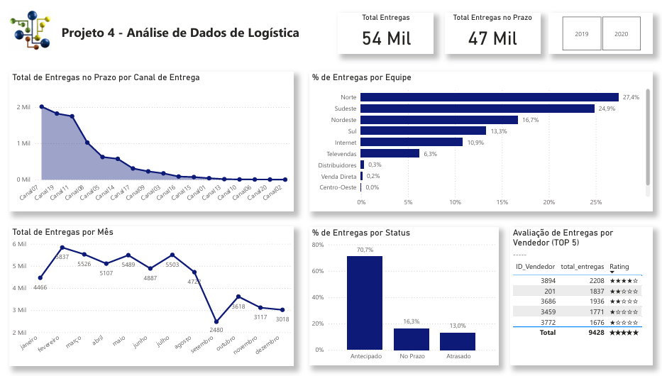

# Projeto 4 - Análise de Dados de Logística
Projeto do curso: "Microsoft Power BI Para Business Intelligence e Data Science", por [Data Science Academy](www.datascienceacademy.com.br). 

## Entendimento do Negócio
A área de logística tem a função de gerenciar o fluxo de produtos e informações desde o ponto de origem até o destino final, de forma eficiente e econômica. Isso inclui a coordenação de  várias  atividades,  como  o  transporte,  armazenamento,  distribuição,  embalagem, gerenciamento de estoque e o gerenciamento da cadeia de suprimentos.  

A logística é fundamental para a operação bem-sucedida de muitas empresas, pois pode afetar diretamente a satisfação do cliente, a produtividade, a eficiência operacional e os custos.  

Ao gerenciar a cadeia de suprimentos de forma eficaz, a área de logística pode garantir que  as  mercadorias  estejam  disponíveis  no  momento  certo,  no  lugar  certo  e  nas  condições adequadas, além de otimizar os recursos e minimizar os custos.  

Além disso, a área de logística pode ajudar a empresa a identificar oportunidades para melhorar sua operação, reduzir desperdícios, aumentar a eficiência e reduzir o tempo de ciclo do pedido(do pedido até a entrega ao cliente ou destino). Com a crescente complexidade dos negócios  e  a  globalização  da  economia,  a importância  da  logística  tem  aumentado significativamente, tornando-se um fator crítico de sucesso para muitas empresas.

## Principais KPIs da Área de Logística
Existem vários indicadores-chave de desempenho (KPIs) que podem ser usados para medir a eficácia e a eficiência da área de logística de uma empresa. Alguns dos principais KPIs da área de logística incluem:

- Tempo de ciclo: o tempo necessário para atender um pedido, desde o momento em que é feito até o momento em que é entregue ao cliente.
- Taxa  de  entrega  no  prazo:  a  porcentagem  de  pedidos  entregues  dentro  do  prazo acordado.
- Custo  de  transporte:  o  custo  médio  por  unidade  ou  por  pedido  para  transportar  os produtos.
- Nível de estoque: o número de dias ou semanas de suprimento de estoque disponível.
- Taxa de devolução: a porcentagem de pedidos devolvidos pelos clientes.
- Índice de acurácia de estoque: a precisão do estoque registrado em relação ao estoque real.
- Taxa de utilização de armazenamento: a porcentagem do espaço de armazenamento disponível que está sendo utilizado.
- Nível  de  serviço  ao  cliente:  a  satisfação  geral  do  cliente  com  o  serviço  de  logística, incluindo tempo de entrega, qualidade do produto eatendimento ao cliente.
- Taxa de ocorrência de avarias: a porcentagem de produtos que sofrem danos durante o transporte ou armazenamento.
- Índice  de  retorno  sobre  investimento  (ROI):  o  retorno  financeiro  gerado  pelos investimentos  em  logística,  como  sistemas  de  gerenciamento  de  armazéns  ou  software  de rastreamento de pedidos.

## Desenvolvimento do Projeto

### Entregas para o Negócio
A solução desenvolvida irá mostrar os seguintes KPIs de Logística:  

- Total de Entregas no Prazo Por Canal de Entrega
- Percentual de Entregas Antecipadas Por Equipede Entrega
- Total de Entregas Por Mês
- Total de Entregas de Produtos dos Top5 Vendedores
- Percentual de Entregas Por Status de Entrega

### Sobre o Dataset
O dataset utilizado neste projeto contém informações relacionadas ao processo logístico de pedidos e entregas. Ele é composto por 53.770 registros e 11 colunas, abrangendo dados de pedidos, clientes, vendedores, prazos e status de entrega.  

As principais informações disponíveis são:  

- Pedidos: identificação do pedido, datas de solicitação, entrega prevista e entrega realizada.
- Clientes e Vendedores: identificação do cliente e do vendedor responsável.
- Logística: equipe responsável pela entrega e canal de entrega utilizado.
- Localização: identificação da cidade associada ao pedido.
- Status: situação final da entrega (por exemplo, entregue no prazo ou com atraso).

### Dicionário de Dados
| Coluna                     | Descrição                                            | Tipo    |
| -------------------------- | ---------------------------------------------------- | ------- |
| **ID_Pedido**              | Identificador único do pedido                        | Inteiro |
| **ID_Cliente**             | Identificador do cliente                             | Inteiro |
| **ID_Vendedor**            | Identificador do vendedor responsável                | Inteiro |
| **Equipe_Entrega**         | Equipe responsável pela entrega do pedido            | Texto   |
| **Canal_Entrega**          | Canal ou modalidade de entrega utilizada             | Texto   |
| **Cidade**                 | Cidade de destino do pedido                          | Texto   |
| **Data_Pedido**            | Data em que o pedido foi realizado                   | Data    |
| **Data_Entrega_Prevista**  | Data prevista para entrega do pedido                 | Data    |
| **Data_Entrega_Realizada** | Data em que a entrega foi efetivamente realizada     | Data    |
| **Status_Entrega**         | Situação final da entrega (no prazo, atrasada, etc.) | Texto   |
| **Tempo_Entrega_Dias**     | Tempo total de entrega em dias                       | Inteiro |

### Dataviz do Projeto
Segue solução proposta, com as respostas solicitadas para a área de negócio.

[End]

### 👍 Meus contatos
- LinkedIn - [renato-malbuquerque](https://www.linkedin.com/in/renato-malbuquerque/)
- GitHub - [renato-albuquerque](https://github.com/renato-albuquerque)
- Discord - [Renato Albuquerque#0025](https://discordapp.com/users/992621595547938837)
- Business Card - [Renato Albuquerque](https://rma-contacts.vercel.app/)
